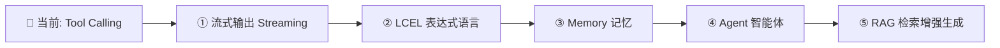

# LangChain.js 2.0 学习笔记

> 学习时间：2026 年 6 月  
> 项目地址：learn-langchain.js  
> 核心主题：LangChain.js Tool Calling（工具调用）+ WebSocket 实践

---

## 一、核心概念

### 1.1 LangChain 是什么

| 项目 | 说明 |
|------|------|
| **本质** | 大模型 API 的统一封装层，不是自己的 AI，是"中间件" |
| **解决什么问题** | 省掉手写 HTTP 请求、JSON 拼接、消息历史管理、工具调用循环等模板代码 |
| **核心理念** | 统一接口（`invoke`/`stream`/`bindTools`），换模型不改业务逻辑 |

### 1.2 消息类型（Messages）

| 类型 | 类名 | 角色 | 使用场景 |
|------|------|------|---------|
| 系统消息 | `SystemMessage` | 给模型设定行为和规则 | 告诉模型"你有工具可调用" |
| 用户消息 | `HumanMessage` | 用户输入 | 每次用户提问 |
| 模型回复 | `AIMessage` | 模型的回复（文字或工具调用） | 记录模型输出，含 `tool_calls` 时表示要调工具 |
| 工具结果 | `ToolMessage` | 将工具执行结果喂回给模型 | 必须带 `tool_call_id` 关联到对应的调用 |

### 1.3 工具调用（Tool Calling）

```
用户 → LLM（决定是否调工具） → 开发者执行工具 → ToolMessage 喂回 → LLM 组织自然语言回复
```

| 概念 | 说明 |
|------|------|
| `tool()` | 定义一个工具：执行逻辑 + 元数据（name, description, schema） |
| `bindTools()` | 将工具注册到模型，请求里自动带上工具定义 |
| `tool_calls` | 模型返回的"决定调工具"的信号，包含 name / args / id |
| `tool_call_id` | 把工具执行结果关联回对应的调用，支持多工具并发 |

#### 模型是怎么推断调用工具的？

这是新手的常见盲区。模型决定是否调工具基于**两个信息**：

1. **system prompt 里的文字描述** → 你写的"你有工具 get_weather..."
2. **工具的结构化定义**（通过 `bindTools` 传入）：
   - `name` → 工具名称
   - `description` → **模型靠这个做语义匹配**，判断这个工具是否适合当前问题
   - `schema` → 参数的格式约束

```
用户问"新乡天气怎样"
         ↓
模型分析:
  "天气" ↔ "查询指定城市的实时天气情况"（description） → 语义匹配
         ↓
  决定调用 get_weather({ location: "新乡" })
```

**关键**：如果 `description` 写得太模糊（如"一个通用信息查询工具"），模型很可能在应该调工具的时候不调。

### 1.4 模型提供商

```typescript
// DeepSeek（兼容 OpenAI 格式）
new ChatOpenAI({
    model: "deepseek-v4-flash",
    apiKey: process.env.DEEPSEEK_API_KEY,
    configuration: { baseURL: "https://api.deepseek.com" },
});
```

多模型切换只需要改构造函数，后续的 `bindTools`、`invoke`、`ToolMessage` 等代码完全一致。

### 1.5 WebSocket 心跳机制

- ping/pong 是 **WebSocket 协议层控制帧**（0x9 / 0xA），**不经过应用层 onmessage**
- 浏览器底层自动回复 pong，JS 代码看不到
- 标准心跳间隔：**30 秒**，不宜过短
- 间隔过短（如 3ms）会冲垮连接，触发 error 事件

---

## 二、代码模板

### 2.1 标准 Tool Calling 模板

```typescript
import { ChatOpenAI } from "@langchain/openai";
import { tool } from "@langchain/core/tools";
import { HumanMessage, AIMessage, ToolMessage, SystemMessage } from "@langchain/core/messages";
import { z } from "zod";

// ① 定义工具
const myTool = tool(
    async (input: { /* 参数类型 */ }) => {
        // 工具执行逻辑
        return result;
    },
    {
        name: "tool_name",
        description: "工具描述（模型靠这个决定是否调用）",
        schema: z.object({
            param: z.string().describe("参数说明"),
        }),
    },
);

// ② 创建模型并绑定工具
const llm = new ChatOpenAI({
    model: "deepseek-v4-flash",
    apiKey: process.env.DEEPSEEK_API_KEY,
    temperature: 0.7,
    timeout: 30000,
    configuration: { baseURL: "https://api.deepseek.com" },
});
const llmWithTools = llm.bindTools([myTool]);

// ③ 调用 & 处理工具调用循环
async function chat() {
    const messages = [
        new SystemMessage("系统提示词"),
        new HumanMessage("用户问题"),
    ];

    const response = await llmWithTools.invoke(messages);

    if (response.tool_calls && response.tool_calls.length > 0) {
        // 执行工具
        const toolCall = response.tool_calls[0];
        const result = await myTool.invoke(toolCall.args as any);

        // 将结果喂回模型
        messages.push(response);
        messages.push(new ToolMessage({
            content: String(result),
            tool_call_id: toolCall.id || "",
        }));

        // 模型生成最终回复
        const final = await llmWithTools.invoke(messages);
        console.log(final.content);
    } else {
        console.log(response.content);
    }
}
```

### 2.2 多模型切换模板

```typescript
function createModel(provider: string) {
    switch (provider) {
        case "deepseek":
            return new ChatOpenAI({
                model: "deepseek-v4-flash",
                apiKey: process.env.DEEPSEEK_API_KEY,
                configuration: { baseURL: "https://api.deepseek.com" },
            });
        case "openai":
            return new ChatOpenAI({
                model: "gpt-4o",
                apiKey: process.env.OPENAI_API_KEY,
            });
        case "anthropic":
            return new ChatAnthropic({
                model: "claude-sonnet-4-6",
                apiKey: process.env.ANTHROPIC_API_KEY,
            });
    }
}

// 之后所有 bindTools、invoke 代码完全一致
const llm = createModel("deepseek");
const llmWithTools = llm.bindTools([getWeatherTool]);
const response = await llmWithTools.invoke(messages);  // 不用改
```

### 2.3 WebSocket 心跳模板

```typescript
import { WebSocketServer, WebSocket } from "ws";

const wss = new WebSocketServer({ port: 8080 });

wss.on("connection", (ws) => {
    // 心跳发送
    const heartbeatInterval = setInterval(() => {
        if (ws.readyState === WebSocket.OPEN) {
            ws.ping();
        }
    }, 30_000);  // 30 秒一次，不要用 3（毫秒）！

    // 心跳响应
    ws.on("pong", () => {
        // 浏览器自动回复 pong
    });

    // 清理
    ws.on("close", () => clearInterval(heartbeatInterval));
});
```

### 2.4 限流模板

```typescript
const RATE_LIMIT = { windowMs: 60_000, maxRequests: 20 };
const rateLimitMap = new Map<string, { count: number; windowStart: number }>();

function checkRateLimit(sessionId: string): boolean {
    const now = Date.now();
    const state = rateLimitMap.get(sessionId);

    if (!state || now - state.windowStart > RATE_LIMIT.windowMs) {
        rateLimitMap.set(sessionId, { count: 1, windowStart: now });
        return true;
    }
    if (state.count >= RATE_LIMIT.maxRequests) return false;

    state.count++;
    return true;
}

// 定期清理过期记录
setInterval(() => {
    const now = Date.now();
    for (const [id, state] of rateLimitMap) {
        if (now - state.windowStart > RATE_LIMIT.windowMs) {
            rateLimitMap.delete(id);
        }
    }
}, 60_000);
```

### 2.5 重试装饰器模板

```typescript
async function withRetry<T>(
    fn: () => Promise<T>,
    label: string,
    maxRetries = 2,
): Promise<T> {
    for (let attempt = 1; attempt <= maxRetries + 1; attempt++) {
        try {
            return await fn();
        } catch (err: any) {
            if (attempt > maxRetries) throw err;
            const delay = Math.min(1000 * Math.pow(2, attempt - 1), 4000);
            console.warn(`${label} 失败，${delay}ms 后重试: ${err.message}`);
            await new Promise((r) => setTimeout(r, delay));
        }
    }
    throw new Error("unreachable");
}
```

---

## 三、常见坑点

| 坑点 | 表现 | 原因 | 解决方案 |
|------|------|------|---------|
| ❌ **心跳间隔写 3ms** | WebSocket 频繁断连，error 事件触发 | 每秒 333 个 ping 冲垮连接 | 改成 `30_000`（30 秒） |
| ❌ **忘记 `tool_call_id`** | 模型分不清多工具结果对应关系 | 多工具并发时没有关联 ID | 每个 ToolMessage 传正确的 `tool_call_id` |
| ❌ **工具 description 太模糊** | 模型应该调工具时没有调 | description 和用户问题语义不匹配 | 描述要清晰、具体、覆盖关键词 |
| ❌ **没用 `bindTools`** | 模型永远不返回 `tool_calls` | 模型不知道有工具存在 | 必须调用 `llm.bindTools([...])` |
| ❌ **端口冲突 EADDRINUSE** | 启动服务器报错 | 上一个进程没关掉 | `taskkill //F //PID <进程号>` |
| ❌ **SystemMessage 被覆盖** | 多轮对话后系统提示词丢失 | 消息历史管理不当 | 每次 clear 时保留 system prompt |
| ❌ **模型参数超时** | API 调用卡住不返回 | 没有设置 timeout | `new ChatOpenAI({ timeout: 30000 })` |

---

## 四、最佳实践

| 实践 | 说明 |
|------|------|
| ✅ **工具 description 要写清楚** | 模型靠语义匹配决定是否调工具，description 是关键 |
| ✅ **心跳用 30 秒间隔** | 够用且不浪费资源，过短会出问题 |
| ✅ **工具调用带重试** | API 可能超时，LangChain 内置 `maxRetries` 或自己写 `withRetry` |
| ✅ **用 `withRetry` 包装工具执行** | 外部 API（如天气接口）不可靠，加指数退避重试 |
| ✅ **限流保护** | 防止客户端疯狂发消息，每个 session 做限流 |
| ✅ **拆分生产/调试日志** | `logger.info` 放关键事件，`logger.debug` 放详细日志 |
| ✅ **关闭时清理资源** | WebSocket 断开时清除 session、rateLimit、定时器 |
| ✅ **优雅关闭（SIGINT/SIGTERM）** | 进程退出前关闭服务器，清理连接 |

---

## 五、学习进度追踪

### 5.1 学习进度总览表

| 模块 | 子组件 | 掌握程度 | 掌握度 | 待加强点 |
|------|--------|:--------:|:------:|----------|
| **LangChain 基础** | LangChain 本质与定位 | 熟练 | ⭐⭐⭐ | - |
| **Model I/O** | ChatModel 创建与配置 | 熟练 | ⭐⭐⭐ | - |
| **Model I/O** | Messages（4 种类型） | 会用 | ⭐⭐ | 消息类型转换、不同角色语义 |
| **Tool Calling** | `tool()` 定义工具 | 熟练 | ⭐⭐⭐ | - |
| **Tool Calling** | `bindTools()` | 熟练 | ⭐⭐⭐ | - |
| **Tool Calling** | 模型推断工具调用逻辑 | 了解 | ⭐ | **模型如何匹配意图和工具** |
| **Tool Calling** | `tool_call_id` 关联机制 | 了解 | ⭐ | **多工具并发的 ID 绑定** |
| **Tool Calling** | ToolMessage 封装与回传 | 会用 | ⭐⭐ | - |
| **Tool Calling** | 工具调用循环（多轮） | 会用 | ⭐⭐ | - |
| **Model Provider** | 多模型切换 | 了解 | ⭐ | 不同模型差异、非 OpenAI 格式 |
| **WebSocket** | ws 库搭建服务器 | 会用 | ⭐⭐ | - |
| **WebSocket** | 心跳机制（ping/pong） | 会用 | ⭐⭐ | - |
| **WebSocket** | 协议层 vs 应用层 | 了解 | ⭐ | 控制帧与数据帧的区别 |
| **项目实践** | ws-chat-server 搭建 | 会用 | ⭐⭐ | 错误处理边界 |
| **项目实践** | 限流实现 | 了解 | ⭐ | 更完善的限流策略 |

### 5.2 知识盲区

| 盲区 | 优先级 | 说明 |
|------|:------:|------|
| 🔴 模型推断工具调用的内部机制 | **高** | 只知道"根据 system prompt"，忽略工具 `description` 的语义匹配作用 |
| 🔴 `tool_call_id` 的真正作用 | **高** | 误以为是"API 返回结果"，实际是多工具并发的关联 ID |
| 🟡 LangChain Agent | 中 | 还没接触，这是 LangChain 最核心的高级功能 |
| 🟡 LCEL（LangChain Expression Language） | 中 | 还没接触，链式编排的核心语法 |
| 🟡 流式输出（Stream） | 中 | WebSocket demo 里还没实现真正的流式 |
| 🟡 RAG（检索增强生成） | 中 | 完全没接触 |

---

## 六、核心问题清单

| 优先级 | 问题 | 考察点 |
|:------:|------|--------|
| 🔴 **高** | 模型是怎么决定调用某个工具的？给了哪些信息让它做判断？ | 工具调用推断机制 |
| 🔴 **高** | `tool_call_id` 的作用是什么？如果模型一次调了 3 个工具，没有这个 ID 会怎样？ | ToolMessage 关联机制 |
| 🔴 **高** | `bindTools` 不写会怎么样？它底层做了什么？ | bindTools 原理 |
| 🔴 **高** | LangChain 和直接调 API 有什么区别？什么时候该用 LangChain？ | LangChain 定位 |
| 🟡 **中** | 一个完整的 Tool Calling 流程有几步？每一步做了什么？ | 整体流程理解 |
| 🟡 **中** | WebSocket 的 ping/pong 是干什么的？为什么前端 onmessage 收不到？ | 协议层理解 |
| 🟡 **中** | 心跳间隔设太短（如 3ms）为什么会导致断连？ | 网络原理 |
| 🟡 **中** | 我要换模型从 DeepSeek 到 GPT-4o，哪些代码要改哪些不用改？ | 多模型封装 |
| 🟡 **中** | ToolMessage 和 AIMessage 有什么区别？ | 消息类型理解 |
| 🟡 **中** | 为什么要用 zod 定义工具参数 schema？不写行吗？ | Schema 的必要性 |
| 🟢 **低** | SystemMessage、HumanMessage、AIMessage 在消息历史中怎么排序？ | 消息顺序 |
| 🟢 **低** | 工具 description 写得太模糊会怎样？写得太宽泛呢？ | description 的关键性 |
| 🟢 **低** | 限流过期记录为什么要定期清理？不清理有什么问题？ | 资源管理 |

---

## 七、下一步学习建议

### 7.1 推荐学习顺序



### 7.2 各阶段详解

| 步骤 | 学习内容 | 预计时间 | 学习目标 | 项目方向 |
|:----:|---------|:--------:|----------|----------|
| **①** | **Streaming（流式输出）** | 1-2 天 | 实现一个字一个字输出的打字机效果 | 给 ws-chat-server 加流式回复 |
| **②** | **LCEL（LangChain 表达式语言）** | 2-3 天 | 学会用 `\|` 管道符串联链 | 用 LCEL 重写工具调用流程 |
| **③** | **Memory（记忆）** | 1-2 天 | 让模型记住上下文对话 | 对话历史管理优化 |
| **④** | **Agent（智能体）** | 3-5 天 | 模型自主规划多步行动 | 做一个能多工具配合的 agent |
| **⑤** | **RAG（检索增强生成）** | 3-5 天 | 从文档中检索信息回答问题 | 做个"本地文档问答机器人" |

### 7.3 推荐实战项目

| 项目 | 难度 | 涵盖内容 | 预计周期 |
|------|:----:|----------|:--------:|
| 🌤️ **天气助手升级**（流式输出） | ⭐⭐ | Streaming + WebSocket | 1 天 |
| 🤖 **多工具 Agent（待办事项+天气+计算器）** | ⭐⭐⭐ | Agent + 多工具编排 | 3-5 天 |
| 📚 **本地知识库问答机器人** | ⭐⭐⭐⭐ | RAG + 向量库 + 文档分割 | 5-7 天 |
| 💬 **完整版智能客服** | ⭐⭐⭐⭐⭐ | Agent + RAG + Memory + 流式 | 7-14 天 |

### 7.4 推荐资源

| 资源 | 类型 | 推荐阶段 |
|------|:----:|:--------:|
| [LangChain.js 官方文档](https://js.langchain.com/docs) | 文档 | 全程参考 |
| [LangChain.js GitHub Examples](https://github.com/langchain-ai/langchainjs/tree/main/examples) | 官方示例 | 学习新功能时对照 |
| LangChain 官网 Agent 概念页 | 概念理解 | Agent 阶段 |
| Vercel AI SDK | 框架 | 进阶 |
| 项目内 `src/` 目录下的示例文件 | 本地代码 | 随时参考 |

---

## 附：项目文件索引

| 文件 | 内容 | 对应概念 |
|------|------|----------|
| `src/0-create-model.ts` | 创建第一个 ChatModel | ChatModel 基础 |
| `src/1-messages.ts` | 消息类型使用 | Messages 四种类型 |
| `src/2-tool-message.ts` | ToolMessage 演示 | ToolMessage 用法 |
| `src/3-tool-calling.ts` | 基础工具调用（假数据） | 工具调用入门 |
| `src/4-tool-calling-api.ts` | 真实 API 工具调用 | 完整 Tool Calling 流程 |
| `src/ws-chat-server.ts` | WebSocket 聊天服务器 | 综合实践 |
