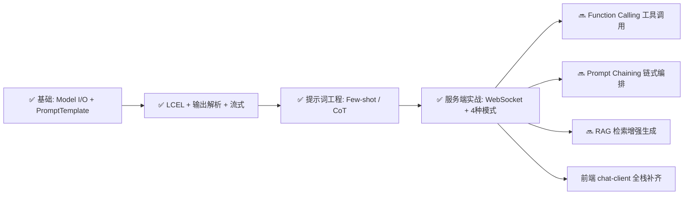

# 3.0 学习笔记
LangChain.js 3.0 学习笔记
学习时间：2026 年 6 月
项目地址：learn-langchain.js
核心主题：LangChain.js 提示词工程（Prompt Engineering）+ LCEL + WebSocket 实践

---

## 一、核心概念

### 1.1 LangChain 是什么

| 项目 | 说明 |
|------|------|
| 本质 | 大模型 API 的统一封装层，不是自己的 AI，是"中间件" |
| 解决什么问题 | 省掉手写 HTTP 请求、JSON 拼接、模板管理、消息历史维护等模板代码 |
| 核心理念 | 统一接口（invoke/stream/batch/pipeline），让 prompt 和模型解耦 |

### 1.2 模型配置（ChatOpenAI）

```typescript
const llm = new ChatOpenAI({
    model: "deepseek-v4-flash",
    temperature: 0.7,        // 0=确定  0.7=平衡  2=随机
    timeout: 30000,
    maxRetries: 2,
});
```

temperature 控制输出确定性：
- **0**：每次输出一样，适合事实问答
- **0.7**：平衡创造性和准确性，适合通用聊天
- **1.0+**：高随机性，适合头脑风暴

### 1.3 提示词模板（PromptTemplate）

| 概念 | 说明 |
|------|------|
| 作用 | 把 prompt 拆成模板（结构）+ 参数（数据），分离后便于复用 |
| 语法 | `{变量名}` 表示占位，`format()` 注入数据 |
| 转义 | `{{ 文字 }}` 会被渲染为 `{ 文字 }`（用于 JSON 示例等场景） |

```typescript
// 定义模板
const prompt = PromptTemplate.fromTemplate(`
你是一个{role}。
{question}
`);

// 注入数据 → 不同角色复用同一模板
await prompt.format({ role: "前端面试官", question: "什么是闭包" });
await prompt.format({ role: "后端面试官", question: "什么是事务" });
```

### 1.4 链式调用（LCEL）

| 概念 | 说明 |
|------|------|
| `.pipe()` | 将多个 Runnable 串联，数据自动流向下游 |
| 对比 | 之前：`format()` → 拿字符串 → `invoke()` → 拿回复 |
| 之后 | `chain.invoke(data)` 一步到位 |

```typescript
// 两节点链
const chain = prompt.pipe(llm);

// 三节点链（加入输出解析器）
const chain = prompt.pipe(llm).pipe(new StringOutputParser());

// 数据流：{topic} → prompt(格式化) → llm(推理) → parser(提取文本) → string
```

**什么时候不用 pipe：** 中间需要插入逻辑（如存对话历史）时不适合，因为 pipe 是直路不能绕弯。

### 1.5 消息类型（Messages）

| 类型 | 类名 | 角色 | 使用场景 |
|------|------|------|---------|
| 系统消息 | SystemMessage | 给模型设定行为和规则 | 设定 AI 角色 |
| 用户消息 | HumanMessage | 用户输入 | 每次用户提问 |
| AI 消息 | AIMessage | 模型的回复 | 记录模型输出 |

### 1.6 输出解析器（OutputParser）

| 解析器 | 输入 → 输出 | 使用场景 |
|--------|------------|---------|
| `StringOutputParser` | AIMessage → string | 纯文本回复 |
| `JsonOutputParser` | AIMessage → JSON 对象 | 结构化数据 |

```typescript
const jsonParser = new JsonOutputParser();
const chain = jsonPrompt.pipe(llm).pipe(jsonParser);
const result = await chain.invoke({ language: "TypeScript" });
console.log(result.features[0]); // 直接当对象用
```

### 1.7 流式输出（Stream）

```typescript
// 一个字一个字接收，实现打字机效果
for await (const chunk of llm.stream(messages)) {
    console.log(chunk); // 逐步打印
}
```

比 `invoke` 的体验更好，用户不用干等。

---

## 二、服务端项目架构

### 2.1 项目结构

```
src/server/
├── index.ts           # 入口 → 启动服务器 + 优雅关闭
├── config.ts          # 集中配置（模型参数、限流、端口）
├── llm.ts             # 模型实例
├── logger.ts          # 日志工具
├── prompts.ts         # ⭐ 所有提示词模板集中管理
├── session.ts         # 会话管理（消息历史）
├── rate-limiter.ts    # 限流
├── ws-server.ts       # WebSocket 核心 + 命令系统
└── handlers/
    ├── invoke.ts      # 非流式回复
    ├── stream.ts      # 流式回复（打字机效果）
    ├── batch.ts       # 批量处理（并行回答多个问题）
    └── structured.ts  # 结构化输出（JSON）
```

### 2.2 四种消息处理模式

| 模式 | 方法 | 特点 |
|------|------|------|
| `invoke` | `llm.invoke()` | 一次性等全部结果 |
| `stream` | `llm.stream()` | 逐字推送，打字机效果 |
| `batch` | `llm.batch()` | 多个问题并行处理 |
| `structured` | `prompt.pipe(llm).pipe(parser)` | 返回 JSON 对象 |

### 2.3 多轮对话原理

```typescript
// 消息结构
messages = [
    SystemMessage("你是一个助手"),
    HumanMessage("什么是闭包"),
    AIMessage("闭包是..."),
    HumanMessage("再举个例子"),
]

// 全部历史发给 AI → 它有上下文
llm.invoke(messages)
```

每次用户发消息：
1. `addUserMessage(session, content)` — 存用户消息
2. `llm.invoke(session.messages)` — 带全部历史调用
3. `addAIMessage(session, reply)` — 存 AI 回复

### 2.4 模板管理系统

```typescript
// 所有模板集中在 prompts.ts，按 key 切换
export const promptTemplates: Record<string, PromptTemplate> = {
    tech:     技术导师（默认）
    life:     生活导师
    english:  英语老师
    interview:面试官
    cot:      思维链（Chain of Thought）
    json:     Few-shot JSON 转换
}
```

通过 `/template <key>` 命令实时切换模板，切换后后续消息全部使用新模板。

---

## 三、提示词工程技巧

### 3.1 角色设定

给提示词加上角色定义，让模型用特定的身份和风格回答。

```typescript
// 技术导师 → 专业严谨 + 带例子
你是一位专业的技术导师。
请用简洁易懂的语言回答问题。
如果涉及技术概念，请配合生活例子说明。

// 生活导师 → 轻松幽默 + 实用技巧
你是一位生活达人，知道各种生活小技巧、收纳妙招、省钱窍门。
请用轻松友好的语气分享实用技巧。
```

### 3.2 Few-shot（少样本学习）

在提示词里给例子，让模型按指定格式输出。

```typescript
// 不加例子 → 输出随意，格式不统一
// 加了例子 → 严格按例子格式输出

例子：
句子：这家餐厅太好吃了   情感：正面
句子：快递等了5天        情感：负面

句子：{text}
情感：      // 只会输出"正面"或"负面"
```

### 3.3 Chain of Thought（思维链）

加了"请一步步分析"之后的效果对比：

| 方式 | 输入 | 输出 |
|------|------|------|
| 直接问 | 球拍+球=1.1元，拍比球贵1元，球多少钱？ | 可能答错（0.1元） |
| 思维链 | 同上 + 请一步步分析 | 设方程 → 推导 → 0.05元 ✅ |

```typescript
// 模板写法
{question}

请一步步分析，把推理过程写清楚，最后给出答案。
```

---

## 四、学习进度总览

### 4.1 基础模块

| 模块 | 子组件 | 掌握度 |
|------|--------|--------|
| 模型配置 | ChatOpenAI、Temperature | ⭐⭐⭐ |
| 提示词 | PromptTemplate、变量注入 | ⭐⭐⭐ |
| 链式调用 | .pipe()、Runnable | ⭐⭐⭐ |
| 输出解析 | StringOutputParser、JsonOutputParser | ⭐⭐⭐ |
| 流式输出 | .stream() | ⭐⭐⭐ |

### 4.2 服务端项目

| 模块 | 子组件 | 掌握度 |
|------|--------|--------|
| WebSocket | ws 服务器、连接管理 | ⭐⭐⭐ |
| 多轮对话 | Session 管理、消息历史 | ⭐⭐⭐ |
| 4种消息模式 | invoke / stream / batch / structured | ⭐⭐⭐ |
| 模板管理 | prompts.ts 集中管理、/template 命令 | ⭐⭐⭐ |
| 限流 | 滑动窗口 | ⭐⭐ |

### 4.3 提示词工程

| 模块 | 子组件 | 掌握度 |
|------|--------|--------|
| 角色设定 | tech / life / english 等模板 | ⭐⭐⭐ |
| Few-shot | 给例子控制输出格式 | ⭐⭐⭐ |
| Chain of Thought | 一步步推理 | ⭐⭐⭐ |
| 模板工程化 | 共享 + 切换 | ⭐⭐⭐ |

---

## 五、核心问题清单

| # | 优先级 | 问题 | 参考答案 |
|---|--------|------|---------|
| 1 | 🔴 高 | `.pipe()` 和手动 `format()`+`invoke()` 的区别？ | pipe 自动传递数据，省去手动接线；但不能插入中间逻辑 |
| 2 | 🔴 高 | 什么时候用 `invoke`，什么时候用 `stream`？ | 等完整结果用 invoke，实时展示用 stream |
| 3 | 🔴 高 | `{var}` 和 `{{var}}` 有什么不同？ | `{var}` 是变量占位，`{{var}}` 是转义的文本花括号 |
| 4 | 🟡 中 | SystemMessage 和 PromptTemplate 的区别？ | SystemMessage 是对话级角色设定，PromptTemplate 是单条消息的包装 |
| 5 | 🟡 中 | batch 和多次 invoke 有什么不同？ | batch 并行一次完成，效率更高；但每个问题独立无上下文 |
| 6 | 🟡 中 | 为什么要先 `addUserMessage` 再 `llm.invoke`？ | 先存历史，invoke 时才能把完整上下文发给 AI |
| 7 | 🟡 中 | Few-shot 和 CoT 的区别？ | Few-shot 管输出格式，CoT 管推理过程 |
| 8 | 🟢 低 | temperature=0 会怎样？ | 输出完全确定，适合事实问答，缺乏创造性 |
| 9 | 🟢 低 | 4种 handler 为什么不用 pipe？ | 中间要插 addUserMessage 存历史，pipe 是直路不能绕弯 |

---

## 六、下一步方向



| 方向 | 说明 | 难度 |
|------|------|------|
| Function Calling | 让 AI 调用函数（查天气、查数据库） | ⭐⭐⭐ |
| Prompt Chaining | 多个 LLM 串起来，前一个输出是后一个输入 | ⭐⭐ |
| RAG | 让 AI 读文档后回答，企业级应用 | ⭐⭐⭐ |
| 前端补齐 | React + WebSocket 联动 | ⭐⭐ |
